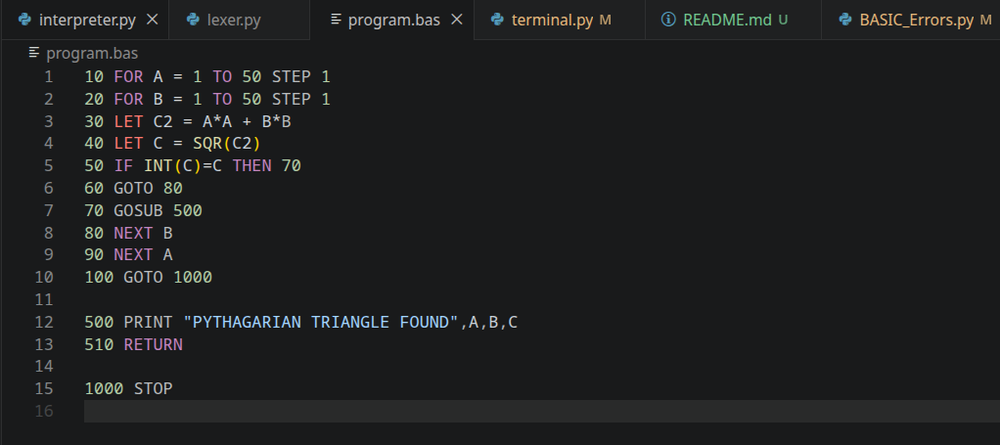

# Dartmouth BASIC Interpreter
An interpreter that takes Dartmouth BASIC source code and executes it using python

# Try it
[Either the latest release](https://github.com/BoomBoomMushroom/Dartmouth-BASIC/releases/) or clone the repo and either compile it yourself or juist run `interpreter.py`/`terminal.py`

# Quick start
Run `terminal.py`

and follow the instructions [here](https://www.dartmouth.edu/basicfifty/basicmanual_1964.pdf) on page 17. Or follow the below

Type `HELLO`

Enter your id (any 6 digit number w/ leading 0s count)

Enter your program number, any 6 or less character string A-Z, 0-9 will work

And now select if you want to load a program by selecting `OLD` or type a new progrma by selecting `TYPE`

Now type out a program

Type `LIST` to view the current program as is

Type `RUN` to run the program!

Type `STOP` to exit

You can also type `SAVE` to save your program inside of /users/USER_NUM/PROGRAM_NUM.bas which can be loaded if you use the `OLD` option in the `HELLO` information collection
